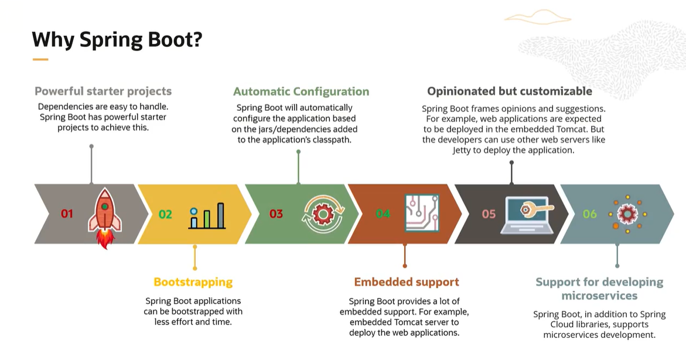

# Spring Boot

Spring Boot is a framework built on top of the Spring ecosystem that helps developers **build production-ready backend applications quickly and with minimal configuration**.

It removes much of the boilerplate required in traditional Spring applications by providing **auto-configuration**, **embedded servers**, and **convention over configuration**.

---

## Why Spring Boot?

Before Spring Boot, building a Spring application usually required:
- Complex XML or Java configuration
- Manual dependency management
- External application servers
- Significant setup time before writing business logic

Spring Boot solves these problems by:
- Auto-configuring commonly used components
- Providing sensible defaults
- Allowing applications to run as standalone services

This makes Spring Boot especially suitable for **microservices and modern backend systems**.

---

## Where Spring Boot Is Used

Spring Boot is widely used in:
- RESTful backend services
- Microservices architectures
- Enterprise and banking systems
- Cloud-native applications
- Event-driven systems

Most modern Java backend applications today are built using Spring Boot.

---

## How to Use These Notes

These notes are intended to be:
- A **learning reference** while studying Spring Boot
- A **quick recall guide** for interviews
- A **practical guide** based on real-world usage

You can read topics independently or follow them as a sequence.